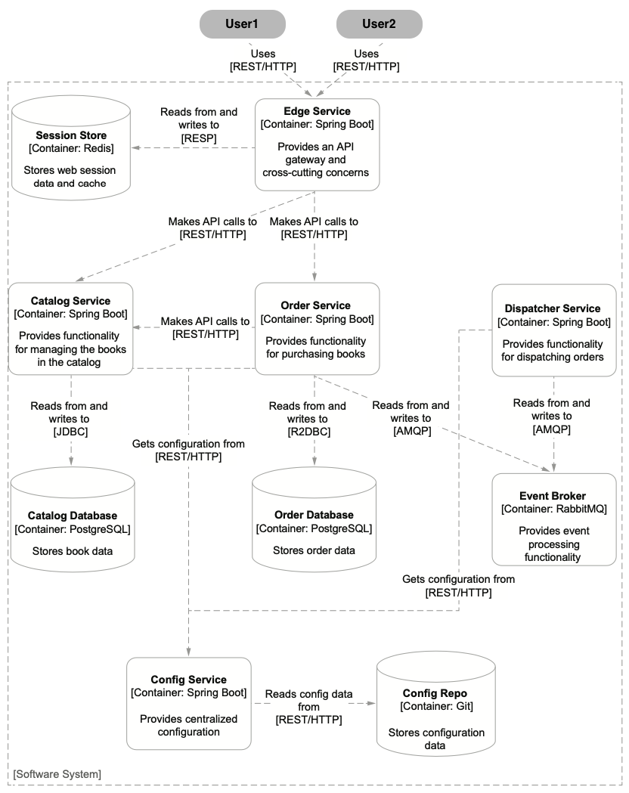

# The Bookshop Software System


## Building Spring Boot application
### Generate services projects
Generate the project of all services from 

### Build Images using Cloud Native Buildpacks
navigate to the root folder of each service and run
 ```
./gradlew bootBuildImage
```
show newly created images by providing the project name and the version:
 ```
docker images <project_name>:<version>
```
check if the containerized application is working providing correct values. The command removes the container after its execution completes.
```
docker run --rm --name CONTAINER_NAME -p PORT_NO:PORT_NO <project_name>:<version>
```
navigate to a browser and `http://localhost:PORT_NO` and see if you get an OK message.
To remove containers:
```
ddocker rm -fv CONTAINER_NAME
```

### Work with Kubernetes
```
minikube start
minikube image load <project_name>:<version>
kubectl create deplyment DEPLOYMENT_NAME --image=<project_name>:<version>
```
Verify the creation of the Depolyments
```
kubectl get deployment
kubectl get pod
```
By default, applications running in Kubernetes are not accessible. Fix it by running:
```
kubectl expose deployment DEPLOYMENT_NAME --name=SERVICE_NAME --port=PORT_NO
```
The Service object exposes the application to other components inside the cluster.
```
kubectl get service SERVICE_NAME
```
To forward the traffic from a local port on the computer (for example, 8000) to the port exposed by the Service inside the cluster (8080) run:
```
kubectl port-forward service/SERVICE_NAME 8000:PORT_NO
```
Stop port-forwarding with `(Ctrl-C)` and delete Service and Deployment with:
```
kubectl delete service SERVICE_NAME
kubectl delete deployment DEPLOYMENT_NAME
```

## Orderflow in action
1) make sure PostgreSQL container is running:
```
docker-compose up -d bookshop-rabbitmq bookshop-postgres
```
2) open up a browser and navigate to ` http://localhost:15672` to access the RabbitMQ management console after logging in with the credentials. Then start the app dispatch service, catalog service and order service `/gradlew bootRun` or from Docker Compose after building the images first. Then add a new book in the catalog:
```
curl -X POST http://localhost:9001/books \
    -H "Content-Type: application/json" \
    -d '{"author": "Thomas Vitale", "title": "New Cloud Native Spring in Action", "isbn": "1234567897", "price": 9.90}'
```
3) Then order 3 copies of that book
```
curl -X POST http://localhost:9002/orders \
    -H "Content-Type: application/json" \
    -d '{"isbn": "1234567891", "quantity": "3"}'
```
4) Fetch the orders:
```
curl http://localhost:9002/orders
```
The status should be "DISPATCHED".

5) Stopp all applications with `(Ctrl-C)` and Docker containers with:
```
docker-compose down
```

NOTE: for any test class:
```
./gradlew test --tests TEST_CLASS_NAME
```

### Dockerfile for the Catalog Service Image
Build the executable file for the application from the root file:
```
./gradlew clean bootJar
```
we have Dockerfile:
```
FROM eclipse-temurin:17
WORKDIR workspace
ARG JAR_FILE=build/libs/*.jar
COPY ${JAR_FILE} catalog-service.jar
ENTRYPOINT ["java", "-jar", "catalog-service.jar"]
```
Run the following commands in a Terminal to build the image:
```
docker build -t catalog-service .
```
Publishing images to GitHub Container Registry
```
docker login ghcr.io
docker push ghcr.io/<github_username>/catalog-service:latest
```
or run 
```
./gradlew bootBuildImage \
    --imageName ghcr.io/<github_username>/catalog-service \
    --publishImage \
    -PregistryUrl=ghcr.io \
    -PregistryUsername=<github_username> \
    -PregistryToken=<github_token>
```
In a browser see if the application works `http://localhost:9001/books`.

## Useful commands
```
minikube start --cpus 2 --memory 4g --driver docker --profile bookshop
kubectl get nodes
kubectl config get-contexts
kubectl config current-context
kubectl config use-context bookshop
kubectl apply -f services
kubectl get pod
```
Then build containers for the applications
```
./gradlew bootBuildImage
```
Further commands:
```
minikube image load catalog-service --profile bookshop
kubectl apply -f k8s/deployment.yml
kubectl get pods -l app=catalog-service
kubectl get svc -l app=catalog-service
kubectl get all -l app=catalog-service
kubectl logs deployment/catalog-service
kubectl delete pod <pod-name>
kubectl delete -f k8s
kubectl delete -f services
minikube stop --profile bookshop
```
## Tilt configuration
```
tilt up
```
Go to the URL where Tilt started its services (by default, it should be (http://localhost:10350)), and monitor the process that Tilt follows to build and deploy the services.
stop it with `(Ctrl-C)` or `tilt down`

## Observability
In the [docker-compose.yml](bookshop-deployment/docker/docker-compose.yml) we added the following lines to every service:
```
- JAVA_TOOL_OPTIONS=-javaagent:/workspace/BOOT-INF/lib/opentelemetry-javaagent-1.32.0.jar
- OTEL_SERVICE_NAME=catalog-service
- OTEL_EXPORTER_OTLP_ENDPOINT=http://tempo:4317
- OTEL_METRICS_EXPORTER=none
```
In every different `build.gradle` files we also set 
```
ext {
    set('otelVersion', "1.32.0")
    ...
    }
	
dependencies {
    ...
    runtimeOnly "io.opentelemetry.javaagent:opentelemetry-javaagent:${otelVersion}"
    ...
}
```
As well as adding
```
logging:
    pattern:
       level: "%5p [${spring.application.name},%X{trace_id},%X{span_id}]"
```
in `src/main/resources/application.yml`. Now when we look at `docker logs catalog-service` we can see `[catalog-service,d9e61c8cf853fe7fdf953422c5ff567a,eef9e08caea9e32a]` showing us the trace id as well as the span id.